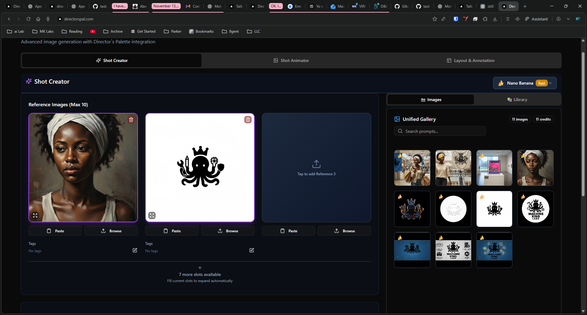
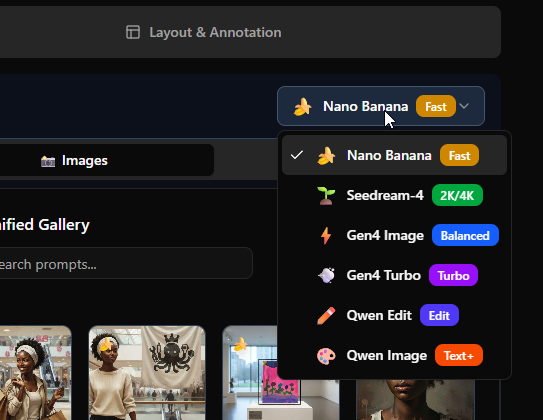
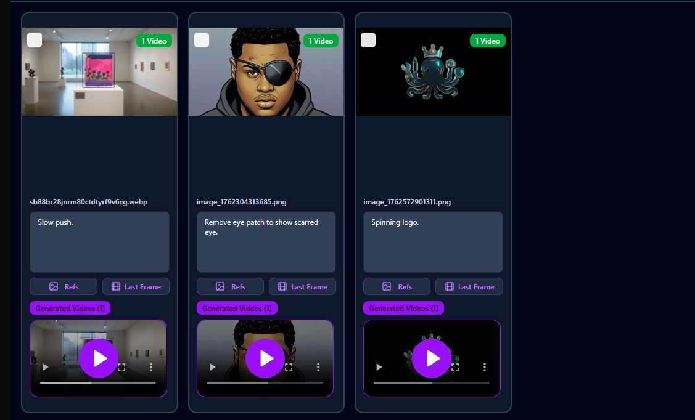

# Director's Palette v2

> **Turn stories into images.** Professional AI image generation with advanced prompt engineering for visual storytelling.

**The Challenge**: Generate 100+ images for a story while keeping characters, locations, and style consistent.

**The Solution**: Director's Palette with a powerful prompting language that gives you control.

---

## 📸 Screenshots

### Shot Creator Interface

*Main interface showing reference image upload, unified gallery, and generated images*

### AI Model Selection

*Choose from 6 AI models: Nano Banana, Seedream-4, Gen4 Image, Gen4 Turbo, Qwen Edit, and Qwen Image*

### Video Generation

*Generate videos from images with prompt variations*

---

## 🎯 The Real Power: Prompting Language

Director's Palette isn't just another image generator. It's a **visual storytelling system** with a specialized prompting language that gives you unprecedented control.

### 🔧 **Bracket Variations** - One Prompt, Multiple Images

Generate variations of the same scene:

```
Hero fights villain in [rainy street, burning building, snowy mountain]
```

**Generates 3 images:**
1. Hero fights villain in rainy street
2. Hero fights villain in burning building
3. Hero fights villain in snowy mountain

**Advanced:** Combine multiple brackets for cartesian products:

```
[Hero, Sidekick] [runs, jumps] in [city, forest]
```

**Generates 8 images** (2 × 2 × 2) showing every combination!

---

### ⛓️ **Pipe Chaining** - Sequential Image Generation

Create action sequences that flow together:

```
Hero stands ready | Hero draws sword | Hero charges forward | Hero strikes
```

**Generates 4 sequential images** showing the complete action progression.

**Perfect for**:
- Fight scenes
- Character transformations
- Environmental changes
- Step-by-step processes

---

### 🎲 **Wild Cards** - Dynamic Randomization

Use `_wildcards_` for random variations:

```
_character_ standing in _location_ at _lighting_
```

**Generates random combinations** like:
- "young woman standing in cyberpunk alley at neon night"
- "old warrior standing in ancient temple at golden hour"
- "child standing in forest clearing at soft morning light"

**Built-in wildcards**: `_character_`, `_location_`, `_lighting_`, `_mood_`, `_camera_`, `_object_`

---

### 🏷️ **@ References** - Reusable Prompt Libraries

Save and reuse prompt categories:

```
@cinematic @lighting_golden_hour @mood_dramatic
```

Tag your reference images and pull them into prompts:

```
@hero_john fighting in warehouse
```

The system automatically loads your saved "hero_john" reference image and prompt templates!

---

## 🎨 Character Consistency - The Secret Sauce

**The Problem**: Generate 100+ images of "John" and have him look the same in every single one.

**The Solution**: Three-part system:

### 1. **Character Sheet Template**

Create once, copy-paste into every prompt:

```
John, tall athletic man in his 30s, brown messy hair, stubble beard,
sharp jawline, green eyes, scar on left cheek, wearing black leather
jacket over white t-shirt, dark jeans, combat boots
```

### 2. **Reference Images**

- Upload/generate one perfect image of John
- Tag it: `john_hero`
- Use Gen4-Image model with reference tags
- System maintains visual consistency across all generations

### 3. **Consistent Seed Values**

```
Seed: 42
```

Same seed + same description = consistent character appearance

---

## 📖 Full Story Workflow Example

**Story**: "John walked into Rosie's Cafe. He spotted Sarah by the window. She looked up and smiled."

**Workflow**:

1. **Create Character Sheets** (do once):
   - John template (copy-paste into every prompt)
   - Sarah template (copy-paste into every prompt)

2. **Create Location Sheet** (do once):
   - Rosie's Cafe description with lighting templates

3. **Generate Images** (one per sentence):

```
# Sentence 1: "John walked into Rosie's Cafe"
John, [CHARACTER SHEET], pushing open glass door of cozy cafe,
exposed brick walls, vintage tables, morning golden light,
cinematic framing, medium shot

Model: gen4-image
Tags: john_hero, rosies_cafe
Seed: 42
```

```
# Sentence 2: "He spotted Sarah by the window"
John POV shot, Sarah, [CHARACTER SHEET], sitting at vintage table
by window, morning light, cozy cafe interior, shallow depth of field

Model: gen4-image
Tags: john_hero, sarah_lead, rosies_cafe
Seed: 42
```

**Result**: Consistent characters, consistent locations, cinematic storytelling!

---

## 💰 Cost Management

Different models for different needs:

| Model | Cost | Best For | Consistency |
|-------|------|----------|-------------|
| **Nano Banana** | ~$0.01 | Quick tests, drafts | Lower |
| **Seedream-4** | ~$0.03 | Production backgrounds | Medium |
| **Gen4 Image** | ~$0.10 | Character close-ups | High ⭐ |

**Example**: 50-image story
- Character shots (20): Gen4 @ $0.10 = $2.00
- Wide shots (15): Seedream @ $0.03 = $0.45
- Backgrounds (15): Nano @ $0.01 = $0.15
- **Total: ~$2.60**

---

## 🚀 Quick Start

### Prerequisites

You'll need accounts with these services:

1. **[Replicate](https://replicate.com)** - AI image generation
   - Sign up at replicate.com
   - Get API token from account settings
   - Add credits ($10 minimum recommended)

2. **[Supabase](https://supabase.com)** - Database & authentication
   - Create free account at supabase.com
   - Create new project
   - Get URL and keys from project settings

### Installation

```bash
# Clone the repository
git clone https://github.com/yourusername/directors-palette-v2.git
cd directors-palette-v2

# Install dependencies
npm install

# Create environment file
cp .env.example .env.local
```

### Required Environment Variables

Edit `.env.local` with your keys:

```bash
# Replicate API (REQUIRED)
REPLICATE_API_TOKEN=r8_xxxxxxxxxxxxxxxxxxxx

# Supabase (REQUIRED)
NEXT_PUBLIC_SUPABASE_URL=https://xxx.supabase.co
NEXT_PUBLIC_SUPABASE_ANON_KEY=eyJhbGciOiJIUzI1NiIsInR5cCI6IkpXVCJ9...
SUPABASE_SERVICE_ROLE_KEY=eyJhbGciOiJIUzI1NiIsInR5cCI6IkpXVCJ9...
```

**Where to find these:**

- **Replicate API Token**: replicate.com → Account Settings → API Tokens
- **Supabase URL**: supabase.com → Project Settings → API → Project URL
- **Supabase Anon Key**: supabase.com → Project Settings → API → anon/public key
- **Supabase Service Key**: supabase.com → Project Settings → API → service_role key (⚠️ Keep secret!)

### Run Development Server

```bash
npm run dev
```

Open [http://localhost:3000](http://localhost:3000) - you're ready to create!

---

## 🛠️ Tech Stack

- **Framework**: Next.js 15.5.4 with App Router & Turbopack
- **React**: 19.1.0
- **TypeScript**: Strict mode
- **Styling**: Tailwind CSS v4 + shadcn/ui
- **State**: Zustand
- **Backend**: Supabase (Auth, Database, Storage)
- **AI**: Replicate API (6 models)
- **Real-time**: Supabase subscriptions for live updates

---

## 📚 Complete Documentation

The prompting language has many more features:

- **Location consistency** with templates
- **Lighting presets** for different times of day
- **Camera angle** templates
- **Emotion variations** for characters
- **Batch generation** strategies
- **Quality control** workflows

**See**: [DIRECTORS_PALETTE_PROMPT_GUIDE.md](./DIRECTORS_PALETTE_PROMPT_GUIDE.md) for the complete 600-line guide!

---

## 📁 Project Structure

```
src/
├── app/                              # Next.js App Router
│   ├── api/
│   │   ├── generation/
│   │   │   ├── image/               # Image generation endpoint
│   │   │   └── video/               # Video generation endpoint
│   │   └── predictions/             # Replicate webhook handler
├── features/
│   └── shot-creator/
│       ├── components/
│       │   ├── creator-prompt-settings/   # Prompt input & syntax
│       │   ├── reference-images/          # Image upload & tagging
│       │   └── unified-gallery/           # Gallery management
│       ├── hooks/
│       │   └── useImageGeneration.ts      # Generation logic
│       ├── services/
│       │   ├── image-generation.service.ts
│       │   └── prompt-syntax-feedback.ts  # Bracket/pipe parsing
│       ├── store/                         # Zustand state
│       └── types/                         # TypeScript definitions
```

---

## ✨ Features in Detail

### Shot Creator
- **6 AI Models**: Nano Banana, Seedream-4, Gen4 Image, Gen4 Turbo, Qwen Image, Qwen Edit
- **Advanced Syntax**: Brackets, pipes, wildcards, @ references
- **Reference Management**: Upload, tag, and reuse images
- **Real-time Settings**: Aspect ratio, resolution, guidance per model
- **Prompt Library**: Save and categorize reusable prompts

### Unified Gallery
- **Search & Filter**: Find images by prompt, model, tags
- **Metadata Tracking**: View all generation settings
- **Batch Operations**: Select and delete multiple images
- **Mobile Optimized**: Fullscreen viewing with gesture controls
- **Credit Tracking**: Monitor usage and costs

### Mobile Experience
- **Simplified Interface**: Clean, focused workflow on small screens
- **Touch Controls**: Swipe, pinch, zoom on images
- **Direct Download**: Save to photo library with one tap
- **Responsive Design**: Adapts from phone to desktop

---

## 🎬 Use Cases

- **Comic Books**: Generate consistent characters across hundreds of panels
- **Storyboards**: Visualize scripts with sequential images
- **Visual Novels**: Create character sprites and backgrounds
- **Marketing**: Generate product variations and lifestyle shots
- **Concept Art**: Explore visual directions quickly
- **Film Pre-viz**: Plan shots and camera angles

---

## 🤝 Contributing

Contributions welcome! Please feel free to submit a Pull Request.

---

## 📄 License

MIT License - Machine King Labs

---

## 🙏 Acknowledgments

- [Next.js](https://nextjs.org/) - React framework
- [shadcn/ui](https://ui.shadcn.com/) - UI components
- [Replicate](https://replicate.com/) - AI model hosting
- [Supabase](https://supabase.com/) - Backend infrastructure
- [Lucide](https://lucide.dev/) - Icons

---

**Machine King Labs** - "With AI anything is possible"

*Generate your first story → [Full Documentation](./DIRECTORS_PALETTE_PROMPT_GUIDE.md)*
